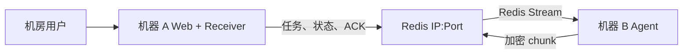

# Redis File Bridge

机器 A（机房）和机器 B（托管机）只能通过一个 Redis IP 和端口通信时，可以使用
本项目从 A 下发文件回传任务，由 B 读取白名单文件并通过 Redis 加密分块传回。

支持 macOS、Linux 和 Windows。推荐 Python 3.9+、Redis 7+。

## 克隆后快速运行

### 方式一：Docker Compose（推荐）

要求安装 Docker Desktop 或 Docker Engine + Compose。

```bash
git clone <你的仓库地址>
cd redis-file-bridge
docker compose -f docker-compose.demo.yml up --build
```

Windows PowerShell 使用相同命令。

启动后打开：

[http://127.0.0.1:8080](http://127.0.0.1:8080)

填写：

```text
文件 ID：demo-file
API Token：demo-browser-token
操作人：任意名称
```

点击“发起回传任务”。状态变成 `cleaned` 后，说明文件已经在机器 A 容器完成解密、
校验和落盘。点击“下载已落盘文件”即可下载。

宿主机保存目录：

```text
./downloads/
```

查看日志：

```bash
docker compose -f docker-compose.demo.yml logs -f
```

停止：

```bash
docker compose -f docker-compose.demo.yml down
```

清除 Redis 演示数据并重新开始：

```bash
docker compose -f docker-compose.demo.yml down -v
```

`docker-compose.demo.yml` 中包含公开演示密钥，只能用于本地体验，不能直接用于生产。

### 方式二：Python 内存演示

这种方式不需要安装 Redis，使用 `fakeredis` 在一个进程中模拟 Redis。进程退出后
任务数据消失。

macOS/Linux：

```bash
git clone <你的仓库地址>
cd redis-file-bridge
python3 -m venv .venv
source .venv/bin/activate
python -m pip install -r requirements-dev.txt
python -m bridge.demo
```

Windows PowerShell：

```powershell
git clone <你的仓库地址>
cd redis-file-bridge
py -m venv .venv
.\.venv\Scripts\Activate.ps1
python -m pip install -r requirements-dev.txt
python -m bridge.demo
```

然后访问 [http://127.0.0.1:8080](http://127.0.0.1:8080)，使用：

```text
文件 ID：demo-file
API Token：demo-browser-token
```

## 使用真实 Redis 在一台机器运行

这一方式会启动三个独立组件：

```text
Redis
机器 B Agent
机器 A Web
```

### 1. 安装 Redis

macOS：

```bash
brew install redis
brew services start redis
```

Ubuntu/Debian：

```bash
sudo apt update
sudo apt install redis-server
sudo systemctl enable --now redis-server
```

Windows 建议使用 Docker 启动 Redis：

```powershell
docker run -d --name redis-file-bridge-redis `
  -p 6379:6379 `
  redis:7.4-alpine `
  redis-server --requirepass change-me --maxmemory 1gb --maxmemory-policy noeviction
```

生产 Redis 必须设置密码或 ACL，并保持：

```text
maxmemory 1gb
maxmemory-policy noeviction
```

### 2. 安装 Python 依赖

macOS/Linux：

```bash
python3 -m venv .venv
source .venv/bin/activate
python -m pip install -r requirements.txt
```

Windows PowerShell：

```powershell
py -m venv .venv
.\.venv\Scripts\Activate.ps1
python -m pip install -r requirements.txt
```

### 3. 创建配置

macOS/Linux：

```bash
cp .env.example .env
cp config/files.example.json config/files.json
python -m bridge.cli generate-key
```

Windows PowerShell：

```powershell
Copy-Item .env.example .env
Copy-Item config/files.example.json config/files.json
python -m bridge.cli generate-key
python -m bridge.cli generate-secret
```

`generate-key` 用于生成 AES 密钥；可执行两次 `generate-secret`，分别生成 HMAC
密钥和 API Token。把结果填入 `.env`：

```dotenv
# 本地 Redis 没有密码时：
REDIS_URL=redis://127.0.0.1:6379/0

# Redis 设置了密码时改用：
# REDIS_URL=redis://:change-me@127.0.0.1:6379/0

BRIDGE_PREFIX=broker_demo
BRIDGE_AGENT_ID=custodian_01
BRIDGE_KEY_ID=v1
BRIDGE_HMAC_KEY=填写第一次generate-secret输出
BRIDGE_ENCRYPTION_KEY=填写generate-key输出
BRIDGE_API_TOKEN=填写第二次generate-secret输出
```

修改 `config/files.json`，路径必须是机器 B 上的绝对路径：

```json
{
  "daily-report": {
    "path": "/absolute/path/to/report.csv",
    "max_file_bytes": 104857600,
    "allowed_hours": "06:00-23:00"
  }
}
```

Windows 路径示例：

```json
{
  "daily-report": {
    "path": "C:\\data\\report.csv",
    "max_file_bytes": 104857600
  }
}
```

### 4. 启动 Agent 和 Web

打开第一个终端，启动机器 B Agent：

```bash
python -m bridge.agent
```

打开第二个终端，启动机器 A Web：

```bash
python -m bridge.web
```

访问：

[http://127.0.0.1:8080](http://127.0.0.1:8080)

健康检查：

```bash
curl http://127.0.0.1:8080/health
```

Windows PowerShell：

```powershell
Invoke-RestMethod http://127.0.0.1:8080/health
```

本地输出默认位于：

```text
downloads/        A 端已校验文件
audit.sqlite3     A 端审计数据库
snapshots/        B 端临时源文件快照
```

这些文件已加入 `.gitignore`，不应提交到 GitHub。

## 分别部署到机器 A 和机器 B

A、B 必须配置相同的：

```text
REDIS_URL
BRIDGE_PREFIX
BRIDGE_AGENT_ID
BRIDGE_KEY_ID
BRIDGE_HMAC_KEY
BRIDGE_ENCRYPTION_KEY
```

机器 A 只需运行：

```bash
python -m bridge.web
```

机器 B 只需运行：

```bash
python -m bridge.agent
```

只有 Redis 是 A/B 之间的网络接口：



A 本地 SQLite 仅记录审计，B 本地 snapshot 仅保证源文件一致性，都不参与跨机器通信。

生产部署还应做到：

- Redis 使用 TLS：`rediss://...`
- 每家券商使用独立 Redis ACL 用户和 `BRIDGE_PREFIX`
- 每家券商使用独立 AES、HMAC 和 API Token
- A 端 Web 放在 HTTPS 和企业身份认证之后
- Agent 用户只拥有白名单文件的只读权限

Redis ACL 示例见：

```text
config/redis-acl.example.conf
```

## 任务和文件协议

任务使用 Redis Streams 消费组。每次重试创建独立 `attempt_id`：

```text
<prefix>:task:<task_id>:attempt:<attempt_id>:manifest
<prefix>:task:<task_id>:attempt:<attempt_id>:chunk:<index>
<prefix>:task:<task_id>:attempt:<attempt_id>:chunk_ack
```

A 只接收 `current_attempt` 指向的数据，旧重试不会污染新传输。

文件默认采用：

```text
chunk_size = 1 MiB
window_size = 16
max_file_size = 100 MiB
max_concurrent_transfers = 1
max_transfer_buffer = 300 MiB
Redis memory warning = 70%
Redis hard stop = 80%
```

每个 chunk 使用 AES-256-GCM 加密，任务和 Manifest 使用 HMAC-SHA256 签名，完整
文件使用 SHA-256 校验。

## 状态

```text
queued
claimed
running
uploading
completed_remote
receiving_local
stored_local
cleaned
downloaded
retrying
failed
cancelled
expired
```

- `completed_remote`：B 已发送完并收到全部 chunk ACK。
- `stored_local`：A 已解密、校验并保存。
- `cleaned`：Redis 临时数据已清理，本地文件仍可下载。
- `downloaded`：用户已经发起浏览器下载。

## 审计

A 本地 SQLite 记录：

```text
task_id, broker, agent_id, file_id, requester, status,
created_at, started_at, completed_at, downloaded_at, cleaned_at,
file_size, sha256, attempt_count, error_message, local_path,
received_chunks, received_bytes, part_path
```

查询最近任务：

```bash
curl "http://127.0.0.1:8080/api/tasks?limit=50" \
  -H "Authorization: Bearer $BRIDGE_API_TOKEN"
```

## API

创建任务：

```bash
curl -X POST http://127.0.0.1:8080/api/tasks \
  -H "Authorization: Bearer $BRIDGE_API_TOKEN" \
  -H "X-Requester: amy.wang" \
  -H "Content-Type: application/json" \
  -d '{"file_id":"daily-report"}'
```

取消任务：

```bash
curl -X POST http://127.0.0.1:8080/api/tasks/TASK_ID/cancel \
  -H "Authorization: Bearer $BRIDGE_API_TOKEN"
```

下载 A 已落盘的文件：

```bash
curl -X POST http://127.0.0.1:8080/api/tasks/TASK_ID/download-ticket \
  -H "Authorization: Bearer $BRIDGE_API_TOKEN"
```

接口返回 60 秒有效、只能使用一次的 `download_url`。浏览器使用该地址原生下载文件，
避免依赖 JavaScript Blob 下载。短期 URL 使用 HMAC 签名，并通过 nonce 防止重放。

## 密钥轮换

`BRIDGE_KEY_ID` 指定当前写入密钥。`BRIDGE_KEYRING_PATH` 可保存当前和历史密钥：

```json
{
  "v1": {
    "hmac": "at-least-32-byte-secret",
    "encryption": "base64-url-encoded-32-byte-key"
  },
  "v2": {
    "hmac": "new-at-least-32-byte-secret",
    "encryption": "new-base64-url-encoded-32-byte-key"
  }
}
```

轮换时先将新密钥同步到 A/B keyring，再修改两端 `BRIDGE_KEY_ID`。旧任务全部结束且
TTL 到期后，才能删除旧密钥。

## macOS 登录自启动（可选）

项目额外提供 macOS 专用脚本：

```bash
brew install redis
python3 -m venv .venv
source .venv/bin/activate
python -m pip install -r requirements.txt
python deploy/macos_install.py
```

运行副本安装到：

```text
~/Library/Application Support/RedisFileBridge
```

卸载自动启动项：

```bash
python deploy/macos_uninstall.py
```

这部分只是可选便利功能，不是运行项目的必要条件。

## 上传 GitHub 前检查

以下内容包含本地密钥、审计或文件数据，不应提交：

```text
.env
.venv/
.runtime/
config/files.json
downloads/
snapshots/
audit.sqlite3*
```

它们已经写入 `.gitignore`。首次创建仓库时执行：

```bash
git init
git add .
git status
```

在 `git status` 的待提交文件中确认没有上述内容，然后再提交：

```bash
git commit -m "Initial Redis file bridge"
git branch -M main
git remote add origin <你的GitHub仓库地址>
git push -u origin main
```

如果这些敏感文件在添加 `.gitignore` 之前已经被 Git 跟踪，需要先取消跟踪：

```bash
git rm --cached .env
git rm --cached config/files.json
git rm -r --cached downloads snapshots .runtime
```

这只会从 Git 暂存索引移除，不会删除本地文件。密钥如果已经推送到远端，不能只靠
删除 Git 文件解决，必须立即更换 Redis 密码、API Token、HMAC 和 AES 密钥。

## 测试

```bash
python -m pip install -r requirements-dev.txt
pytest
```
